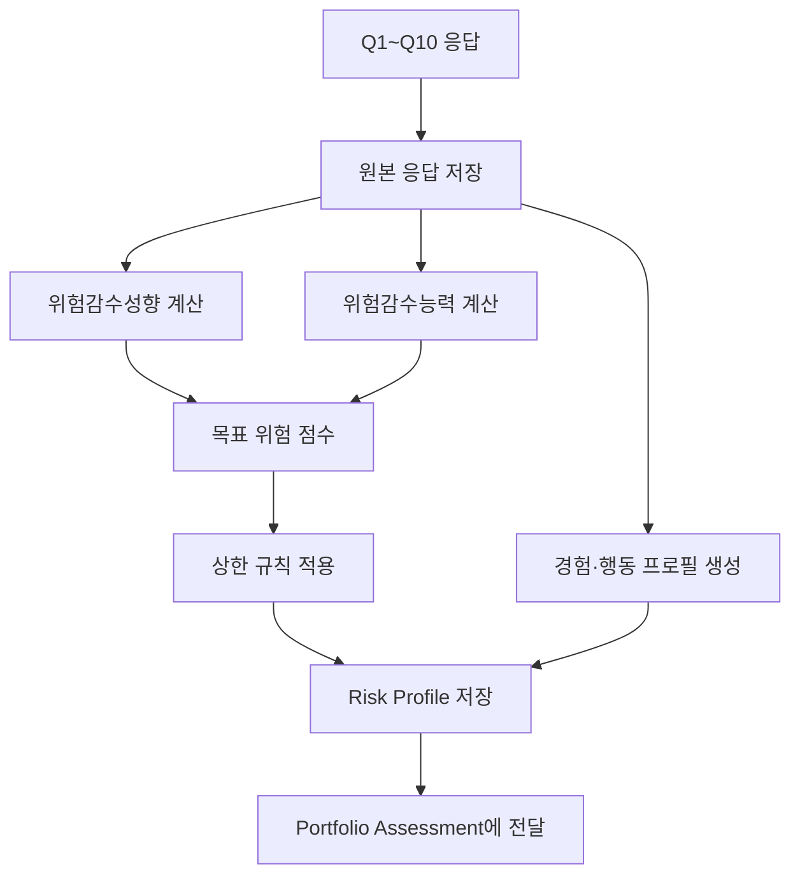

# 사용자 투자성향 조사 MVP 개발 명세 — 중복 제거본

> **문서 역할**  
> 이 문서는 사용자의 설문 응답을 받아 **목표 위험 수준과 자기보고 행동 프로필을 생성하는 과정**만 정의한다.  
> 계좌 더미 데이터, 시장데이터, 포트폴리오 위험지표, `risk_gap_score` 계산은  
> `보유_포트폴리오_평가_MVP_리서치_개발명세_중복제거본.md`에서 관리한다.
>
> **버전:** v0.2  
> **작성일:** 2026-07-20

---

## 1. 기능 범위와 책임

### 이 문서가 담당하는 내용

- 투자성향 관련 연구 근거
- 사용자 설문 10문항
- 위험감수성향·위험감수능력 계산
- 자기보고식 매매행동 분류
- 설문 원본 및 파생 프로필 저장 구조
- Risk Profile API와 설문 화면 흐름

### 다른 문서가 담당하는 내용

- 계좌 연동 및 더미 포트폴리오
- 수정주가·시장지수·무위험수익률 수집
- 변동성·Sharpe Ratio·MDD·CVaR·집중도 계산
- `portfolio_risk_score_v0.1`
- `risk_gap_score`와 포트폴리오 적합도
- 포트폴리오 평가 대시보드

### 핵심 원칙

1. 설문 결과와 실제 행동을 분리한다.
2. 투자 경험은 위험선호와 동일하게 취급하지 않는다.
3. 현재 위험한 포트폴리오를 보유했다는 이유로 사용자를 공격형으로 재분류하지 않는다.
4. 본 설문은 원 논문의 문항을 그대로 복제한 검증 척도가 아니라 MVP용 휴리스틱이다.
5. 원본 응답과 파생 점수를 분리하고 계산 버전을 저장한다.

---

## 2. 연구 근거

## 2.1 Grable & Lytton — *Financial Risk Tolerance Revisited*

- **저자:** John E. Grable, Ruth H. Lytton
- **연도:** 1999
- **DOI:** https://doi.org/10.1016/S1057-0810(99)00041-4

### 간단 요약

금융위험 감수성향을 투자 경험, 손실 가능성, 선택 상황 등 여러 차원에서 측정하기 위한 13문항 평가도구를 개발하고 검증했다. 금융위험 감수성향을 단일 질문으로 판단하기보다 여러 상황형 문항으로 측정해야 한다는 근거를 제공한다.

### MVP 반영

원문의 13문항을 그대로 사용하지 않고 다음 영역으로 간소화한다.

- 투자기간
- 투자목표
- 최대 손실 감내도
- 시장 하락 시 행동
- 안전자산·위험자산 선택
- 투자경험
- 비상자금

### 산출값

| 필드 | 의미 |
|---|---|
| `risk_willingness_score` | 손실과 변동성을 심리적으로 감수하려는 정도 |
| `risk_capacity_score` | 투자기간과 유동성 여건상 실제 손실을 감당할 수 있는 정도 |
| `experience_level` | 투자 경험 수준 |

---

## 2.2 Schooley & Worden — *Risk Aversion Measures: Comparing Attitudes and Asset Allocation*

- **저자:** Diane K. Schooley, Debra Drecnik Worden
- **연도:** 1996
- **DOI:** https://doi.org/10.1016/S1057-0810(96)90003-7

### 간단 요약

설문에서 밝힌 금융위험 감수 의향과 실제 포트폴리오의 위험자산 비중을 비교했다. 사용자가 말하는 위험 태도와 실제 자산배분을 함께 봐야 한다는 근거를 제공한다.

### MVP 반영

본 문서에서는 설문 기반 `target_risk_score_adjusted`까지만 생성한다. 실제 포트폴리오와의 비교는 포트폴리오 평가 문서가 담당한다.

```text
Risk Profile 출력
→ Portfolio Assessment 입력
→ 실제 위험과 목표 위험 비교
```

---

## 2.3 Dorn & Huberman — *Talk and Action: What Individual Investors Say and What They Do*

- **저자:** Daniel Dorn, Gur Huberman
- **연도:** 2005
- **DOI:** https://doi.org/10.1007/s10679-005-4997-z

### 간단 요약

개인투자자의 설문 응답과 실제 증권사 거래기록을 결합해, 투자자가 말한 성향과 실제 분산투자·거래행동의 차이를 분석했다.

### MVP 반영

정확한 거래내역을 직접 요구하지 않고 다음 자기보고 문항을 사용한다.

- 최근 3개월 거래 빈도
- 최근 3개월 포트폴리오 구성 변경 정도
- 수익·손실 종목 처분 기준

계좌 연동 이후 실제 회전율·보유기간과 비교할 수 있도록 별도 행동 프로필로 저장한다. 이 행동 점수는 `target_risk_score`에 합산하지 않는다.

---

# 3. MVP 설문 질문

> 투자 방식에는 정답이 없습니다. 정확한 수치가 기억나지 않아도 본인과 가장 가까운 항목을 선택해주세요. 결과는 투자 판단을 대신하지 않는 참고 정보입니다.

## Q1. 투자 예정 기간

현재 투자한 자금을 사용할 예정 시점은 언제인가요?

| 코드 | 선택지 | 점수 | 영역 |
|---|---|---:|---|
| `H1` | 1년 이내 | 0 | 위험감수능력 |
| `H2` | 1년 이상 3년 이내 | 1 | 위험감수능력 |
| `H3` | 3년 이상 5년 이내 | 2 | 위험감수능력 |
| `H4` | 5년 이상 10년 이내 | 3 | 위험감수능력 |
| `H5` | 10년 이후 또는 사용 계획 없음 | 4 | 위험감수능력 |

## Q2. 투자 목표

| 코드 | 선택지 | 점수 |
|---|---|---:|
| `G1` | 원금 손실을 최대한 피한다 | 0 |
| `G2` | 예·적금보다 조금 높은 수익을 원한다 | 1 |
| `G3` | 일정한 위험을 감수하고 안정적으로 늘린다 | 2 |
| `G4` | 높은 변동성을 감수하고 높은 수익을 추구한다 | 3 |
| `G5` | 단기간에 큰 수익을 추구한다 | 4 |

`G5`는 `short_term_high_return_flag`도 생성한다.

## Q3. 최대 손실 감내도

| 코드 | 선택지 | 점수 |
|---|---|---:|
| `L1` | 손실을 거의 감당하기 어렵다 | 0 |
| `L2` | 약 5% 이내 | 1 |
| `L3` | 약 10% 이내 | 2 |
| `L4` | 약 20% 이내 | 3 |
| `L5` | 30% 이상도 장기적으로 감당 가능 | 4 |

선택지를 수치로도 변환해 `maximum_loss_tolerance`에 저장한다.

## Q4. 시장 전체가 20% 하락했지만 기업 전망에는 변화가 없을 때

| 코드 | 선택지 | 점수 |
|---|---|---:|
| `D1` | 전부 매도 | 0 |
| `D2` | 대부분 매도 | 1 |
| `D3` | 일부 매도 후 관찰 | 2 |
| `D4` | 그대로 보유 | 3 |
| `D5` | 추가 매수 | 4 |
| `D0` | 잘 모르겠다 | `null` |

## Q5. 안전자산과 위험자산 선택

- 상품 A: 수익 약 3%, 손실 가능성이 매우 낮음
- 상품 B: 큰 수익 가능성과 원금 손실 가능성이 함께 존재

| 코드 | 선택지 | 점수 |
|---|---|---:|
| `P1` | 반드시 A | 0 |
| `P2` | A를 선택할 가능성이 높음 | 1 |
| `P3` | 두 상품을 비슷하게 선택 | 2 |
| `P4` | B를 선택할 가능성이 높음 | 3 |
| `P5` | 반드시 B | 4 |

## Q6. 투자 경험

| 코드 | 선택지 | 값 |
|---|---|---:|
| `E1` | 경험 없음 | 0 |
| `E2` | 1년 미만 | 1 |
| `E3` | 1년 이상 3년 미만 | 2 |
| `E4` | 3년 이상 5년 미만 | 3 |
| `E5` | 5년 이상 | 4 |

투자 경험은 설명 난이도 조절에 사용하며 위험감수성향 점수에 직접 합산하지 않는다.

## Q7. 비상자금

| 코드 | 선택지 | 점수 |
|---|---|---:|
| `C1` | 거의 없음 | 0 |
| `C2` | 1개월 생활비 미만 | 1 |
| `C3` | 1~3개월 생활비 | 2 |
| `C4` | 3~6개월 생활비 | 3 |
| `C5` | 6개월 이상 생활비 | 4 |

## Q8. 최근 3개월 거래 빈도

| 코드 | 선택지 | 점수 |
|---|---|---:|
| `T1` | 거래하지 않음 | 0 |
| `T2` | 월 1~2회 | 1 |
| `T3` | 월 3~5회 | 2 |
| `T4` | 월 6~10회 | 3 |
| `T5` | 월 11회 이상 | 4 |
| `T0` | 잘 모르겠다 | `null` |

## Q9. 최근 3개월 포트폴리오 구성 변경 정도

| 코드 | 선택지 | 점수 |
|---|---|---:|
| `R1` | 거의 바뀌지 않음 | 0 |
| `R2` | 25% 미만 | 1 |
| `R3` | 약 25~50% | 2 |
| `R4` | 약 50~75% | 3 |
| `R5` | 대부분 변경 | 4 |
| `R0` | 잘 모르겠다 | `null` |

## Q10. 수익·손실 종목 처분 기준

| 코드 | 선택지 | 행동 유형 |
|---|---|---|
| `S1` | 수익 종목을 먼저 매도 | `PROFIT_TAKING` |
| `S2` | 손실 종목을 먼저 매도 | `LOSS_CUTTING` |
| `S3` | 기업 전망을 기준으로 결정 | `INFORMATION_BASED` |
| `S4` | 손절선·목표수익률 기준 | `RULE_BASED` |
| `S5` | 상황에 따라 결정 | `SITUATIONAL` |
| `S0` | 경험이 없거나 잘 모름 | `UNKNOWN` |

Q10은 서열 점수로 합산하지 않는다.

---

# 4. 점수 산출

## 4.1 위험감수성향

사용 문항: Q2, Q3, Q4, Q5

```text
risk_willingness_score
= 유효 응답 점수 평균 / 4 × 100
```

## 4.2 위험감수능력

사용 문항: Q1, Q7

```text
risk_capacity_score
= 유효 응답 점수 평균 / 4 × 100
```

## 4.3 목표 위험 점수

```text
target_risk_score_raw
= risk_willingness_score × 0.6
+ risk_capacity_score × 0.4
```

가중치는 논문에서 확정한 수치가 아닌 MVP 휴리스틱이며 설정 파일로 관리한다.

### 상한 안전장치

| 조건 | 처리 |
|---|---|
| 투자기간 1년 이내 | 최대 `MODERATE_CONSERVATIVE` |
| 비상자금 거의 없음 | 최대 `MODERATE_CONSERVATIVE` |
| 위험성향 유효 응답 3개 미만 | 결과 보류 |
| `잘 모르겠다` 다수 | `confidence_score` 하향 |

안전장치 적용 후 값을 `target_risk_score_adjusted`로 저장한다.

## 4.4 위험등급

| 점수 | 코드 | 표시명 |
|---:|---|---|
| 0~20 | `CONSERVATIVE` | 안정형 |
| 20 초과~40 | `MODERATE_CONSERVATIVE` | 안정추구형 |
| 40 초과~60 | `BALANCED` | 위험중립형 |
| 60 초과~80 | `GROWTH` | 적극투자형 |
| 80 초과~100 | `AGGRESSIVE` | 공격투자형 |

## 4.5 자기보고 매매활동성

사용 문항: Q8, Q9

```text
self_reported_activity_score
= 유효 응답 점수 평균 / 4 × 100
```

| 점수 | 코드 |
|---:|---|
| 0~20 | `LOW_TURNOVER` |
| 20 초과~50 | `GENERAL_MANAGEMENT` |
| 50 초과~75 | `ACTIVE_TRADING` |
| 75 초과~100 | `HIGH_TURNOVER` |

이 점수는 투자성향이 아니라 이후 실제 행동과 비교하기 위한 별도 프로필이다.

## 4.6 응답 신뢰도

```text
confidence_score
= 핵심 영역의 유효 응답 수 / 핵심 문항 수
```

모순 응답은 별도 플래그를 남긴다.

예:

```text
최대 손실 감내 5%
+ 시장 20% 하락 시 추가매수
+ 단기 투자기간
→ inconsistent_answer_flag
```

---

# 5. 처리 흐름



---

# 6. 데이터 모델

## 6.1 설문 원본

```json
{
  "survey_id": "survey_001",
  "user_id": "demo_user_001",
  "survey_version": "risk_mvp_v0.2",
  "answers": {
    "Q1": "H4",
    "Q2": "G3",
    "Q3": "L3",
    "Q4": "D4",
    "Q5": "P3",
    "Q6": "E3",
    "Q7": "C4",
    "Q8": "T3",
    "Q9": "R2",
    "Q10": "S4"
  }
}
```

## 6.2 파생 Risk Profile

```json
{
  "user_id": "demo_user_001",
  "survey_id": "survey_001",
  "scoring_version": "risk_scoring_v0.2",
  "risk_willingness_score": 56.25,
  "risk_capacity_score": 75.0,
  "target_risk_score_raw": 63.75,
  "target_risk_score_adjusted": 63.75,
  "target_risk_band": "GROWTH",
  "maximum_loss_tolerance": 0.10,
  "investment_horizon_code": "H4",
  "experience_level": 2,
  "self_reported_activity_score": 37.5,
  "activity_band": "GENERAL_MANAGEMENT",
  "disposition_style": "RULE_BASED",
  "confidence_score": 1.0,
  "flags": []
}
```

---

# 7. API와 화면

## API

```http
POST /api/v1/risk-surveys
GET  /api/v1/users/{user_id}/risk-profile
```

설문 API는 원본 응답을 저장한 뒤 Risk Profile을 생성한다. 포트폴리오 평가 API는 이 문서에서 정의하지 않는다.

## 화면 흐름

1. 설문 안내 및 약 2분 소요 표시
2. Q1~Q10 진행률 표시
3. 응답 수정 지원
4. 위험감수성향·위험감수능력·경험·행동 유형 표시
5. 계좌 연결 또는 데모 분석으로 이동

표시 문구는 단정 대신 추정형을 사용한다.

```text
응답 기준으로 적극투자형 성향이 추정됩니다.
현재 포트폴리오와의 적합도는 계좌 분석 후 확인할 수 있습니다.
```

---

# 8. 현실적 한계

- 원 논문의 검증 척도를 그대로 사용하지 않아 동일한 타당도를 보장할 수 없다.
- 자기보고 응답은 실제 시장 상황의 행동과 다를 수 있다.
- 위험감수성향은 시간과 시장 분위기에 따라 바뀔 수 있다.
- 투자기간과 비상자금만으로 위험감수능력을 완전히 측정할 수 없다.
- 거래 빈도가 높다고 공격형 또는 비합리적이라고 단정할 수 없다.
- `60:40` 가중치와 등급 경계는 운영 데이터로 재검증해야 한다.
- 금융상품 판매 적합성 평가를 대체하지 않으며 투자 권유에 사용하지 않는다.

---

# 9. 완료 기준

- [ ] 질문 코드와 선택지가 버전 관리된다.
- [ ] `null` 응답을 0점으로 처리하지 않는다.
- [ ] 위험감수성향과 위험감수능력을 분리한다.
- [ ] 투자 경험과 행동 점수를 목표 위험에 합산하지 않는다.
- [ ] 원본 응답과 파생 프로필을 분리 저장한다.
- [ ] 상한 규칙과 신뢰도 플래그를 적용한다.
- [ ] Portfolio Assessment가 필요한 필드를 조회할 수 있다.
- [ ] 사용자에게 결과가 참고 정보임을 표시한다.

---

# 10. 참고문헌

1. Grable, J. E., & Lytton, R. H. (1999). *Financial Risk Tolerance Revisited: The Development of a Risk Assessment Instrument*. Financial Services Review, 8(3), 163–181.
2. Schooley, D. K., & Worden, D. D. (1996). *Risk Aversion Measures: Comparing Attitudes and Asset Allocation*. Financial Services Review, 5(2), 87–99.
3. Dorn, D., & Huberman, G. (2005). *Talk and Action: What Individual Investors Say and What They Do*. Review of Finance, 9(4), 437–481.