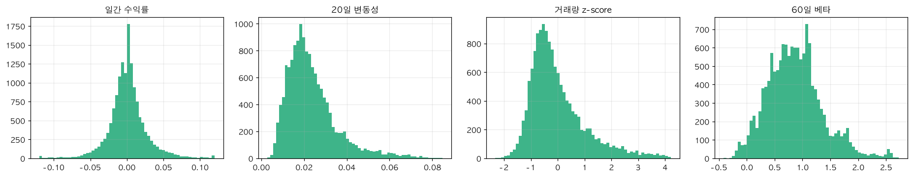
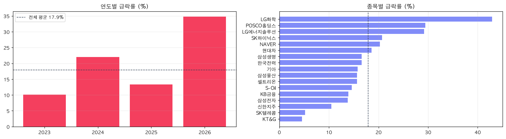
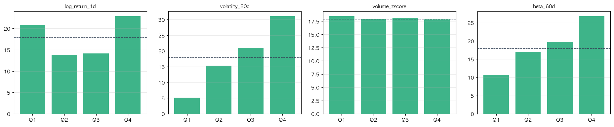
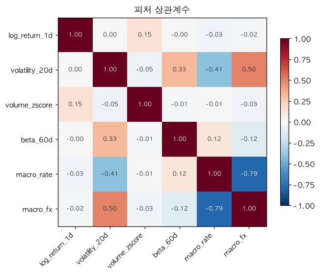
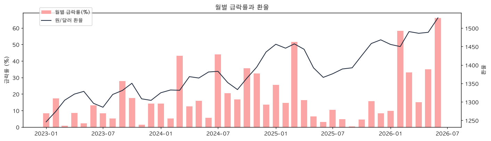
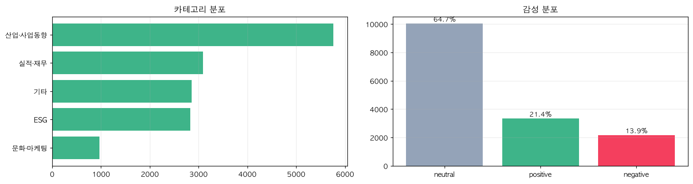

# EDA 리포트 — 개미의 우산

> 생성: 2026-07-28 07:04 · 대상 `data/ml_ready_real.csv`  
> `backend/scripts/eda_report.py` 가 자동 생성합니다.

---

## 1. 데이터 개요

| 항목 | 값 |
| --- | --- |
| 종목 수 | 17개 |
| 기간 | 2023-01-02 ~ 2026-07-27 |
| 거래일 수 | 869일 |
| 전체 행 | 14,773행 |
| 라벨 확정 행 | 14,433행 |
| 라벨 미확정(최근 20거래일) | 340행 |

**결측률** — 롤링 계산 초기 구간에서만 발생하며 학습에서 제외됩니다.

| 피처 | 결측률 |
| --- | --- |
| `beta_60d` | 6.79% |
| `volatility_20d` | 2.30% |
| `volume_zscore` | 2.19% |
| `log_return_1d` | 0.12% |
| `macro_rate` | 0.00% |
| `macro_fx` | 0.00% |

## 2. 가격 피처 분포

| 피처 | 평균 | 표준편차 | 최솟값 | 중앙값 | 최댓값 |
| --- | --- | --- | --- | --- | --- |
| `log_return_1d` | 0.0009 | 0.0265 | -0.1720 | 0.0000 | 0.2504 |
| `volatility_20d` | 0.0236 | 0.0119 | 0.0028 | 0.0209 | 0.0848 |
| `volume_zscore` | -0.0063 | 1.0388 | -2.3249 | -0.2659 | 4.2130 |
| `beta_60d` | 0.8639 | 0.4901 | -0.4224 | 0.8366 | 2.7304 |

## 3. 라벨(급락) 분석

**전체 양성률(급락 발생 비율) = 17.88%** (급락 2,581건 / 전체 14,433건)

> 드문 사건이므로 정확도(Accuracy)는 지표로 쓰지 않습니다. "모두 안전"이라고만 답해도 정확도가 82.1% 나옵니다.

### 연도별 급락률 — 시기에 따라 편차가 큽니다

| 연도 | 행 수 | 급락률 |
| --- | ---: | ---: |
| 2023 | 4,165 | 10.1% |
| 2024 | 4,148 | 22.0% |
| 2025 | 4,114 | 13.4% |
| 2026 | 2,006 | 34.7% |

> 검증을 단일 분할이 아니라 시계열 교차검증으로 하는 이유입니다. 특정 시기만 테스트하면 결과가 왜곡됩니다.

### 종목별 급락률

| 종목 | 행 수 | 급락률 |
| --- | ---: | ---: |
| LG화학 | 849 | 42.9% |
| POSCO홀딩스 | 849 | 29.4% |
| LG에너지솔루션 | 849 | 29.2% |
| SK하이닉스 | 849 | 20.7% |
| NAVER | 849 | 20.3% |
| 현대차 | 849 | 18.6% |
| 삼성생명 | 849 | 16.6% |
| 한국전력 | 849 | 16.6% |
| 기아 | 849 | 15.8% |
| 삼성물산 | 849 | 15.7% |
| 셀트리온 | 849 | 15.7% |
| S-Oil | 849 | 14.6% |
| KB금융 | 849 | 13.9% |
| 삼성전자 | 849 | 13.8% |
| 신한지주 | 849 | 10.5% |
| SK텔레콤 | 849 | 5.2% |
| KT&G | 849 | 4.6% |

## 4. 피처와 급락의 관계

각 피처를 4구간(사분위)으로 나눠 구간별 실제 급락률을 봅니다. 구간이 올라갈수록 급락률이 뚜렷하게 변하면 예측에 쓸 만한 신호입니다.

| 피처 | Q1(낮음) | Q2 | Q3 | Q4(높음) | 최대/최소 |
| --- | ---: | ---: | ---: | ---: | ---: |
| `log_return_1d` | 20.8% | 13.8% | 14.1% | 22.9% | **1.66배** |
| `volatility_20d` | 5.1% | 15.3% | 21.0% | 31.1% | **6.12배** |
| `volume_zscore` | 18.5% | 18.0% | 18.1% | 17.8% | **1.04배** |
| `beta_60d` | 10.7% | 17.0% | 19.7% | 26.8% | **2.52배** |

> `volatility_20d`의 구간 간 격차가 가장 큽니다. 변동성이 급락 예측의 핵심 신호라는 근거입니다.

### 피처 간 상관관계

## 5. 거시 지표와 급락 시기

| 거시 피처 | 급락 라벨과의 상관 |
| --- | ---: |
| `macro_rate` | -0.056 |
| `macro_fx` | +0.158 |

> 거시 지표는 모든 종목이 같은 값을 공유하므로 **종목 간 판별에는 기여하지 못합니다.** 시장 국면을 구분하는 용도로만 의미가 있습니다.

## 6. 뉴스 데이터

- 분류 기사 **15,511건** · 17종목
- 뉴스가 붙은 칸 **11,925 / 14,773 (80.7%)**
- 방향 신호(≠0)가 남은 칸 4,804 (32.5%)

> 중립이 64.7%로 가장 많습니다. 뉴스 기사가 본래 중립적 문체로 쓰이기 때문이며, 이 때문에 방향 신호만으로는 '뉴스 없음'과 '중립 뉴스'가 구분되지 않아 기사 건수를 별도 피처로 추가했습니다.

### 부정 뉴스가 많으면 더 떨어지는가

| 조건 | 급락률 | 기준 대비 |
| --- | ---: | ---: |
| 부정 기사 0건 (n=2,283) | 16.1% | 0.90배 |
| 최근 20일 부정 3건 이상 (n=6,789) | 17.7% | 0.99배 |
| 최근 20일 부정 10건 이상 (n=160) | 5.0% | 0.28배 |

변동성을 통제하면(같은 변동성 구간 안에서 비교) 차이가 사라집니다.

| 변동성 구간 | 부정 0건 | 부정 3건+ | 차이 |
| --- | ---: | ---: | ---: |
| 낮음 | 6.4% | 4.0% | -2.4%p |
| 중하 | 14.0% | 14.2% | +0.3%p |
| 중상 | 24.9% | 19.2% | -5.7%p |
| 높음 | 30.9% | 29.9% | -1.1%p |

> 부정 뉴스가 많은 종목은 대형주라 원래 급락이 적습니다(교란 요인). 변동성을 통제하면 뉴스의 추가 기여가 확인되지 않습니다.

---

## 요약

1. 급락은 전체의 **17.9%** 로 드문 사건 → 정확도 대신 PR-AUC를 씁니다.
2. 연도별 급락률 편차가 커서 **시계열 교차검증**이 필요합니다.
3. **변동성이 가장 강한 단일 신호**이며, 구간별 급락률 격차가 가장 큽니다.
4. 거시 지표는 전 종목 공통이라 **종목 간 판별에 기여하지 못합니다.**
5. 부정 뉴스와 급락의 겉보기 관계는 **대형주 편중에 의한 착시**였습니다.
